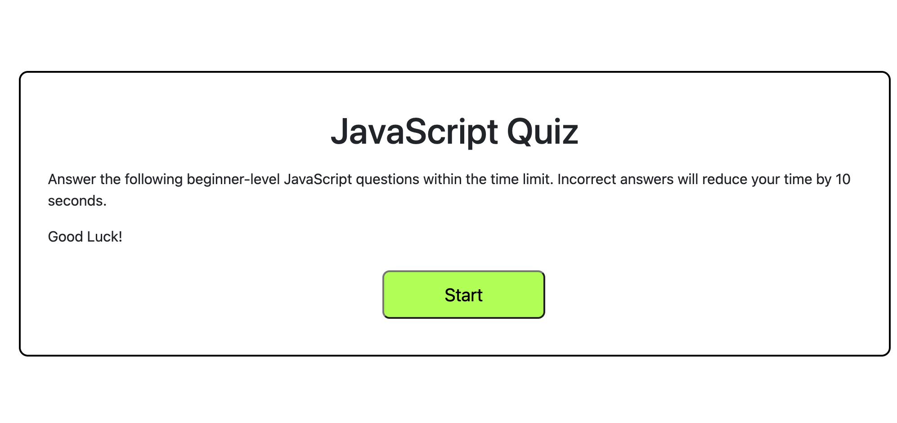
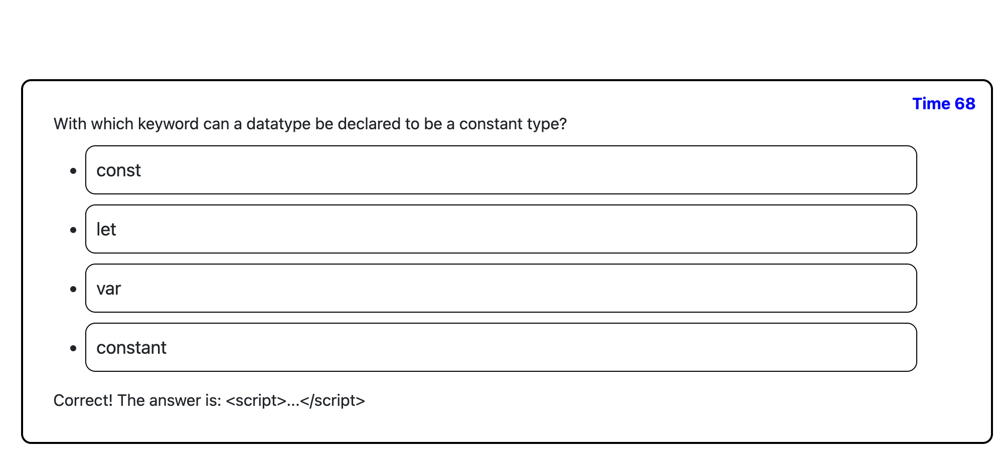
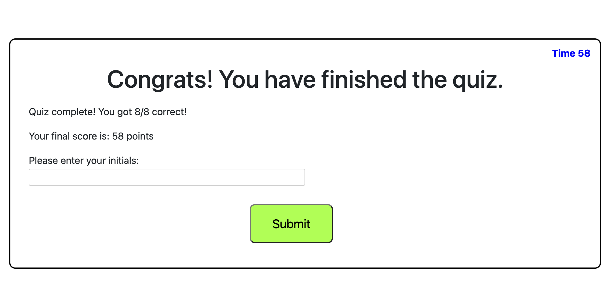
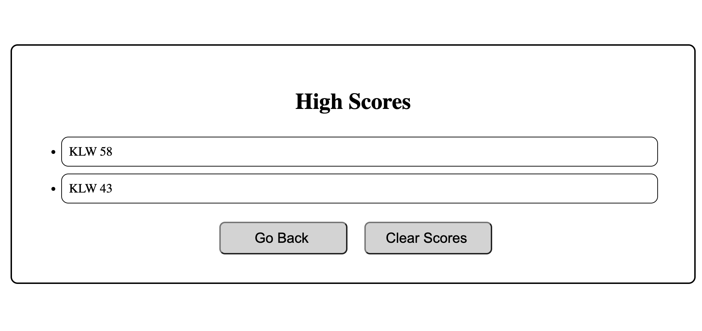

# Code Quiz

## Purpose
The purpose of this project is to create an application that allows to take a short javascript quiz, track store, and persist high-score data. 

## Application Details

### Technologies Used:
    * HTML
    * CSS
    * JavaScript
    * Local Storage API
    * Dynamically generated HTML

## Screenshots

## Deployed Application 

This application is deployed through GitHub Pages. 
This application can be accessed via this link: https://kalecodes.github.io/code-quiz/
